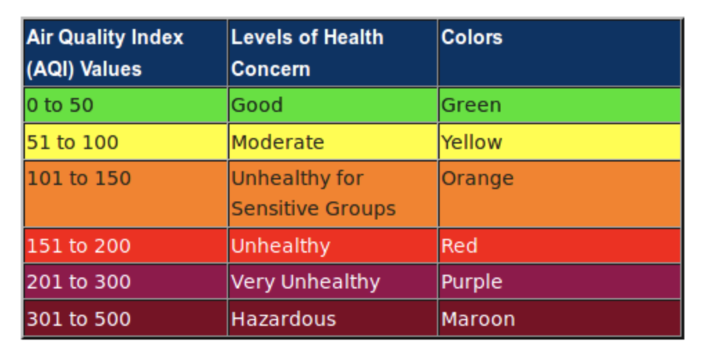

# Air Quality Monitor

From: https://openschoolsolutions.org/measure-particulate-matter-with-a-raspberry-pi/

With a few improvements:

Informs you if your air quality is low.

Checks your air quality daily

**Does not work with Python3**

